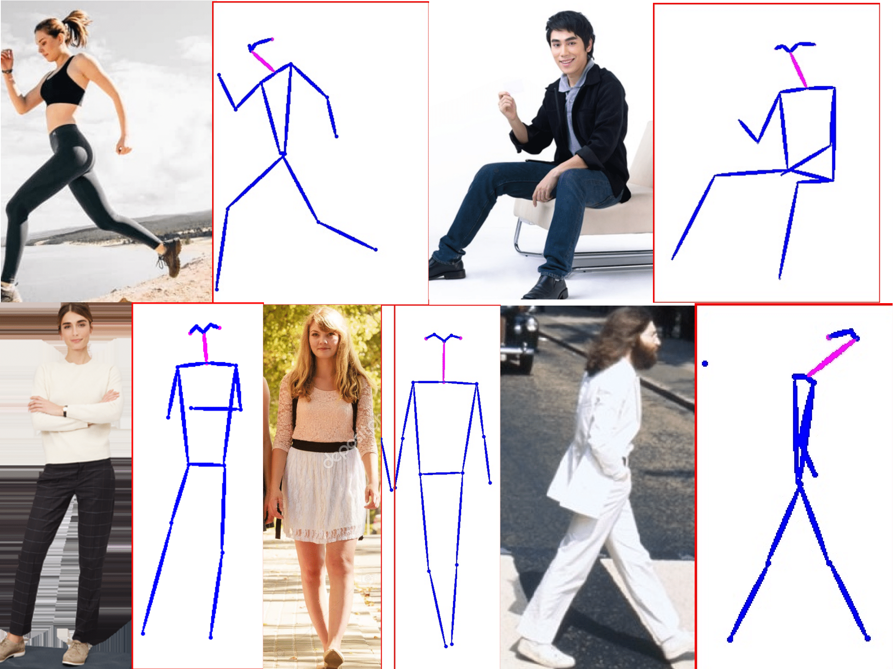
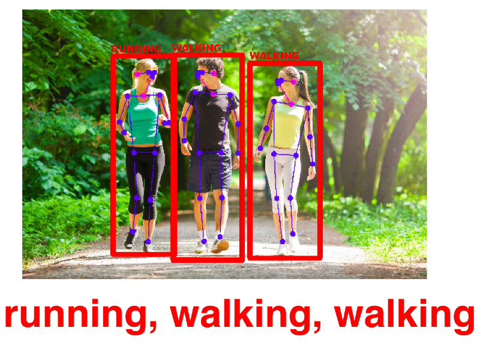

# Multi Pose Identification
This work propose a single end-to-end model able to detect
people, estimate their pose, and recognize each one of their activities by their pose

The paper is under review.
For now, you can check more details (Pt-Br) here: https://repositorio.bc.ufg.br/tede/handle/tede/10191